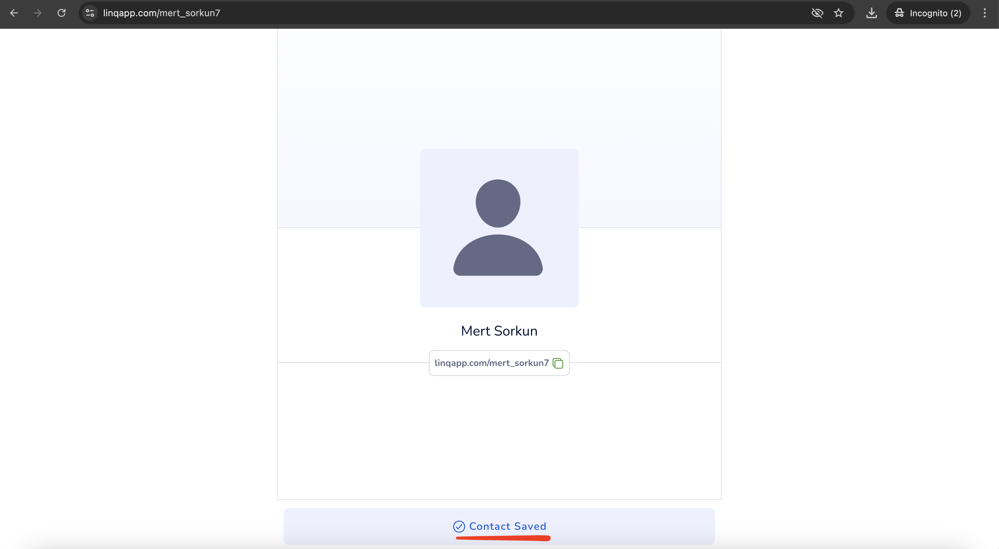
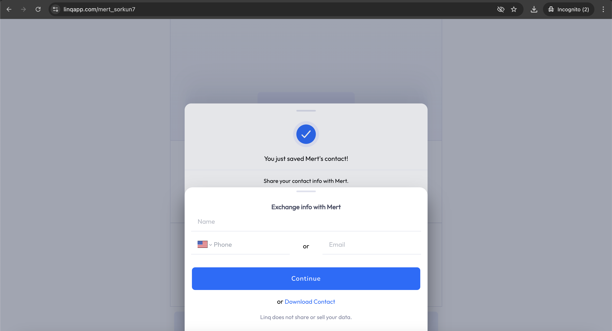

# Bug Reports – Viewing Profile and Exchanging Contact Information as a Visitor

---

### **Bug Report 1: "Contact Saved" Message Appears Without Saving Information**
- **Bug ID:** BUG001
- **Description:** The system shows a **"Contact Saved"** notification even when no contact information was entered or saved.
- **Steps to Reproduce:**
  1. Open the profile page as a visitor (e.g., https://linqapp.com/mert_sorkun7).
  2. Click "Exchange Contact" but do not fill out any information (leave the fields empty).
  3. Press ESC to close the pop-up window.
  4. Observe that the system shows a "Contact Saved" confirmation even though no data was submitted.
- **Expected Behavior:**
  - The system should not display "Contact Saved" if no information is provided.
- **Actual Behavior:**
  - The "Contact Saved" message appears even when no information is entered.
- **Screenshot:** 

---

### **Bug Report 2: "You just saved Mert's contact" Message Displays When Download is Canceled Without Saving**
- **Bug ID:** BUG002
- **Description:** The "Contact Saved" message appears even when the user clicks "Download Contact" and cancels the download, without saving the contact.
- **Steps to Reproduce:**
  1. Open the profile page as a visitor (e.g., https://linqapp.com/mert_sorkun7).
  2. Click "Exchange Contact."
  3. Click "Download Contact."
  4. Cancel the download in the file dialog.
  5. Observe that the "You just saved Mert's contact" message appears in the background, even though the contact was not downloaded.
- **Expected Behavior:**
  - The system should not show the "Contact Saved" message if the contact download was canceled.
- **Actual Behavior:**
  - The "Contact Saved" message is displayed even though the download was canceled and the contact was not saved.
- **Screenshot:** 

---

